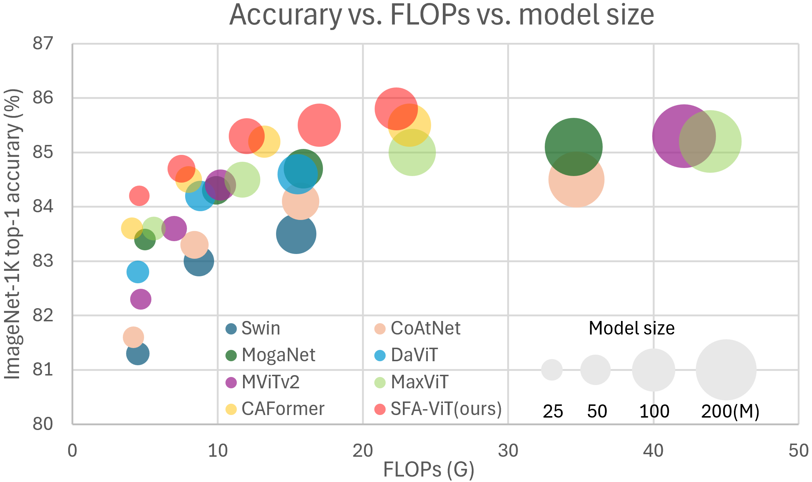
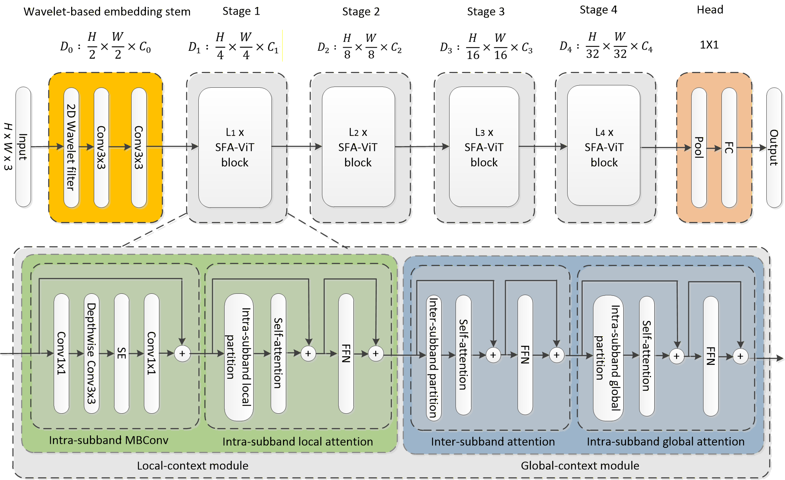
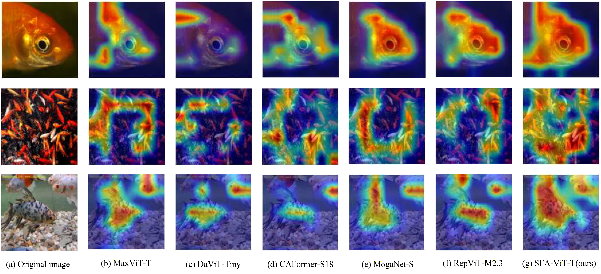

# SFA-ViT: Subband-Factorized Spatial-Frequency Attention for Vision Transformers


Figure 1: Comparison of Top-1 accuracy, FLOPs, and number of parameters. Our models are trained from scratch at **224×224** resolution unless otherwise noted. † denote **256×256** training/evaluation.

SFA-ViT is a vision transformer architecture designed for spatial-frequency representation learning. Instead of modeling all visual tokens only in the spatial domain, SFA-ViT first organizes visual features into wavelet subbands through a lightweight embedding stem. It then factorizes attention into within-subband spatial modeling and cross-subband interaction.

This design allows spatial dependencies to be modeled within relatively coherent frequency components while preserving communication between low-frequency structural information and high-frequency detail information. Across ImageNet-1K classification, COCO 2017 object detection and instance segmentation, ADE20K semantic segmentation, and Moving MNIST video prediction, SFA-ViT provides strong accuracy-efficiency trade-offs across multiple model scales.

For ImageNet-1K classification, SFA-ViT-B achieves **85.5%** top-1 accuracy at **224×224** resolution with **100.0M** parameters and **17.0G** FLOPs when trained from scratch. With **256×256** input resolution, SFA-ViT-B reaches **85.8%** top-1 accuracy with **22.2G** FLOPs.


Figure 2: Overall architecture of SFA-ViT. Normalization and activation layers are omitted for simplicity.

## Requirements

Install the required packages with:

```bash
pip install -r requirements.txt
```

## Model Zoo and Results

### Image Classification on ImageNet-1K

#### Models Trained from Scratch

| Model | Resolution | Params (M) | FLOPs (G) | Top-1 Acc. | Checkpoint |
| :---: | :--------: | ---------: | --------: | ---------: | :--------: |
| SFA-ViT-P1 | 224×224 | 5.0 | 1.04 | 79.6% | [Download](https://drive.google.com/file/d/1M0b99bKGPduX-vuisFrRqTIdgV_Rvoit/view?usp=drive_link) |
| SFA-ViT-P2 | 224×224 | 6.0 | 1.35 | 80.8% | [Download](https://drive.google.com/file/d/1x6wJdOQFDUwixa13n18tz4fFP5Ozy_rf/view?usp=drive_link) |
| SFA-ViT-N | 224×224 | 10.6 | 1.97 | 82.2% | [Download](https://drive.google.com/file/d/1wp91nRojR4s2HbCraT4AYruCFuT2lCkW/view?usp=drive_link) |
| SFA-ViT-T | 224×224 | 23.3 | 4.6 | 84.2% | [Download](https://drive.google.com/file/d/1lKVhoW2cobAxYJaTqOUZgk-KAT3er3HF/view?usp=drive_link) |
| SFA-ViT-S | 224×224 | 41.7 | 7.5 | 84.8% | [Download](https://drive.google.com/file/d/1wDG9wbh-eP-xkDkPktnjnxjmXohij6m3/view?usp=drive_link) |
| SFA-ViT-M | 224×224 | 69.7 | 12.4 | 85.3% | [Download](https://drive.google.com/file/d/1_6V3v2dUOPwTmOk4_TwIrCu0EfwelHmF/view?usp=drive_link) |
| SFA-ViT-B | 224×224 | 100.0 | 17.0 | 85.5% | [Download](https://drive.google.com/file/d/1NfftjR1dZPHZLwTScPWt_yO_4i0s_-Ql/view?usp=drive_link) |
| SFA-ViT-B | 256×256 | 100.0 | 22.2 | 85.8% | [Download](https://drive.google.com/file/d/11ibSJJZTNlGH02DnBpF2ZPlPSDCxS0to/view?usp=drive_link) |


#### Fine-Tuned Models

| Model | Resolution | Params (M) | FLOPs (G) | Top-1 Acc. | Checkpoint |
| :---: | :--------: | ---------: | --------: | ---------: | :--------: |
| SFA-ViT-T | 384×384 | 23.3 | 14.1 | 85.3% | [Download](https://drive.google.com/file/d/1jyxFexCE3wYNkoiHvx2jCUaC5dyCzAk3/view?usp=drive_link) |
| SFA-ViT-S | 384×384 | 41.8 | 22.9 | 85.8% | [Download](https://drive.google.com/file/d/1EMxVrvHDl_hdnzjdm4jRxCgjl1HAtSX4/view?usp=drive_link) |
| SFA-ViT-M | 384×384 | 69.7 | 37.8 | 86.2% | [Download](https://drive.google.com/file/d/1tGoE8rd_QSoPwRjynjJwBeFCPlGHqURa/view?usp=drive_link) |
| SFA-ViT-B | 384×384 | 100.0 | 51.7 | 86.3% | [Download](https://drive.google.com/file/d/1ml5yYYTi5ud1wzuwDETpyY1_U_vbS5g6/view?usp=drive_link) |

### Training on ImageNet-1K

Use the provided training script as follows:

```bash
bash ./scripts/sfavit_t_224_1k.sh /path/to/imagenet-1k num_gpus
```

Example:

```bash
bash ./scripts/sfavit_t_224_1k.sh /data/imagenet-1k 4
```

### Evaluation

Evaluate a trained SFA-ViT checkpoint on ImageNet-1K with:

```bash
python validate.py /path/to/imagenet-1k \
  --model sfavit_t_224 \
  --checkpoint /path/to/checkpoint \
  --img-size 224
```

### Parameter and FLOP Counting

Compute the number of parameters and FLOPs for an SFA-ViT variant with:

```bash
python get_flops.py --model sfavit_t_224 --img-size 224
```

### Grad-CAM Visualization

Generate Grad-CAM activation maps with:

```bash
python cam_image.py \
  --data-dir ./images \
  --checkpoint /path/to/checkpoint
```


Figure 3: Grad-CAM visualizations of different ViT models.

## Object Detection and Instance Segmentation on COCO 2017

### Mask R-CNN

| Method | Backbone | Pretraining | Resolution | Params | FLOPs | LR Schedule | Box mAP | Box AP50 | Box AP75 | Mask mAP | Mask AP50 | Mask AP75 | Checkpoint |
| :----: | :------: | :---------: | :--------: | -----: | ----: | :---------: | ------: | -------: | -------: | -------: | --------: | --------: | :--------: |
| Mask R-CNN | SFA-ViT-T | ImageNet-1K | 1333×800 | M | G | MS 1× | 45.8 | 68.8 | 50.0 | 41.4 | 65.4 | 44.2 | [Download](https://drive.google.com/file/d/1NM3iFBt1rbqK4eGiyuL5v5wKXzEeO2uk/view?usp=drive_link) |
| Mask R-CNN | SFA-ViT-T | ImageNet-1K | 1120×896 | 42.7M | 254.6G | MS 3× | 48.6 | 70.6 | 53.6 | 43.7 | 67.6 | 47.2 | [Download](https://drive.google.com/file/d/1NM3iFBt1rbqK4eGiyuL5v5wKXzEeO2uk/view?usp=drive_link) |
| Mask R-CNN | SFA-ViT-T | ImageNet-1K | 1333×800 |  M |  G | MS 3× | 48.5 | 70.6 | 53.1 | 43.6 | 67.5 | 46.9 | [Download](https://drive.google.com/file/d/1NM3iFBt1rbqK4eGiyuL5v5wKXzEeO2uk/view?usp=drive_link) |

### Cascade Mask R-CNN

| Method | Backbone | Pretraining | Resolution | Params | FLOPs | LR Schedule | Box mAP | Box AP50 | Box AP75 | Mask mAP | Mask AP50 | Mask AP75 | Checkpoint |
| :----: | :------: | :---------: | :--------: | -----: | ----: | :---------: | ------: | -------: | -------: | -------: | --------: | --------: | :--------: |
| Cascade Mask R-CNN | SFA-ViT-T | ImageNet-1K | 1120×896 | 80.5M | 733G | GIoU + MS 3× | 52.3 | 71.1 | 56.6 | 45.2 | 68.4 | 49.0 | [Download](https://drive.google.com/file/d/1B5mwlHaQ0NIGsNU-KaV9G3GwYXP1ux_y/view?usp=drive_link) |
| Cascade Mask R-CNN | SFA-ViT-S | ImageNet-1K | 1120×896 | 98.9M | 788G | GIoU + MS 3× | 53.2 | 72.2 | 57.9 | 46.0 | 69.6 | 49.9 | [Download](https://drive.google.com/file/d/1wd4y75lIEgQJtZt7vfDjmHkWq3HyVrFb/view?usp=drive_link) |
| Cascade Mask R-CNN | SFA-ViT-M | ImageNet-1K | 1120×896 | 126.7M | 885G | GIoU + MS 3× | 53.6 | 72.4 | 58.2 | 46.4 | 69.8 | 50.5 | [Download](https://drive.google.com/file/d/1vA57nOvdWcOzAzLKz06kWCvzTNLqJhPQ/view?usp=drive_link) |

## Semantic Segmentation on ADE20K

| Method | Backbone | Pretraining | Resolution | Params | FLOPs | Iterations | mIoU | Checkpoint |
| :----: | :------: | :---------: | :--------: | -----: | ----: | ---------: | ---: | :--------: |
| UperNet | SFA-ViT-T | ImageNet-1K | 512×2048 | 52M | 939G | 160K | 49.1 | [Download](https://drive.google.com/file/d/1ST19h3ZGLhvciei7vxBxL4zrp69J12kR/view?usp=drive_link) |
| UperNet | SFA-ViT-S | ImageNet-1K | 512×2048 | 71M | 999G | 160K | 50.6 | [Download](https://drive.google.com/file/d/1sSgXxOu0NpvnY1gbULS_EWPhu6ZgNV5z/view?usp=drive_link) |

## Video Prediction on Moving MNIST

| Architecture | Setting | Params | FLOPs | MSE | MAE | SSIM | PSNR | Checkpoint |
| :----------: | :-----: | -----: | ----: | --: | --: | ---: | ---: | :--------: |
| SFA-ViT | 200 epochs | 37.6M | 14.0G | 25.68 | 75.59 | 0.9317 | 38.38 | [Download](https://drive.google.com/file/d/1yAO4uUK1H9ir9BuR3GYb3roiuz2RZr54/view?usp=drive_link) |
| SFA-ViT | 2000 epochs | 37.6M | 14.0G | 16.37 | 53.57 | 0.9579 | 39.26 | [Download](https://drive.google.com/file/d/1uubVrPrF2CH_VY6oD76uxlRdmLEJzCoW/view?usp=drive_link) |

## Acknowledgements

This repository builds on or refers to the following open-source projects:

- [pytorch-image-models (timm)](https://github.com/huggingface/pytorch-image-models)
- [MaxViT](https://github.com/google-research/maxvit)
- [MogaNet](https://github.com/Westlake-AI/MogaNet)
- [MMDetection](https://github.com/open-mmlab/mmdetection)
- [OpenSTL](https://github.com/chengtan9907/OpenSTL)
